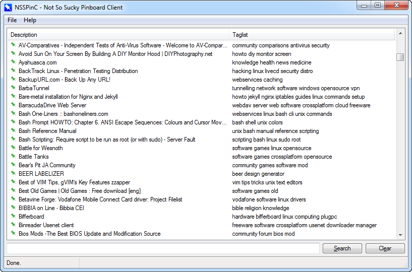

# NSSPinC

**PLEASE NOTE THAT THIS IS BETA SOFTWARE. I'M IN NO WAY RESPONSIBLE FOR ANY DATA LOSS.**

  

**NSSPinC**, acronym for *Not So Sucky Pinboard Client*, is a minimalistic [Pinboard](http://pinboard.in) client with caching support. It's written in [AutoHotkey](http://ahkscript.org) and offers very basic viewing and searching features and a full fledged caching system.

### Download

The build archive is [here on GitHub](https://github.com/cyruz-git/NSSPinC/releases).

### Source files

Name | Description
-----|------------
docs\ | Folder containing the documentation, built with MkDocs.
Resources\ | Folder containing icon resources.
Tools\ | Folder containing caching required tools and wkhtmltox utilities.
COPYING | GNU General Public License.
COPYING.LESSER | GNU Lesser General Public License.
LibSetup.ahk | Libraries setup script.
NSSPinC_Func.ahk | Working functions collection.
NSSPinC_Main.ahk | Main script, containing initializations and includes.
NSSPinC_UI.ahk | Main GUI and labels.
NSSPinC_UI_2.ahk | Bookmark item GUI.
NSSPinC_UI_3.ahk | Caching confirmation GUI.
PinboardCacheMngr.ahk | Caching manager.
PinboardConnector.ahk | Pinboard API implementation.
PinboardDbHandler.ahk | Pinboard database handler and updater.
README.md | This document.

### How to compile

*NSSPinC* should be compiled with the **Ahk2Exe** compiler, that can be downloaded from the [AHKscript download page](http://ahkscript.org/download/). Version **1.1.19.02** or superior is required.

1. Run the `LibSetup.ahk` script in advance to retrieve the required libraries from GitHub.

2. Browse to the files so that the fields are filled as follows:

        Source:      path\to\NSSPinC_Main.ahk
        Destination: path\to\NSSPinC.exe
        Custom Icon: path\to\Resources\icon_1.ico

3. Select a Unicode **Base File** indicating your desired build and click on the **> Convert <** button.

The documentation site is built with [MkDocs](http://www.mkdocs.org/).

### Full README available [here](docs/docs/index.md)