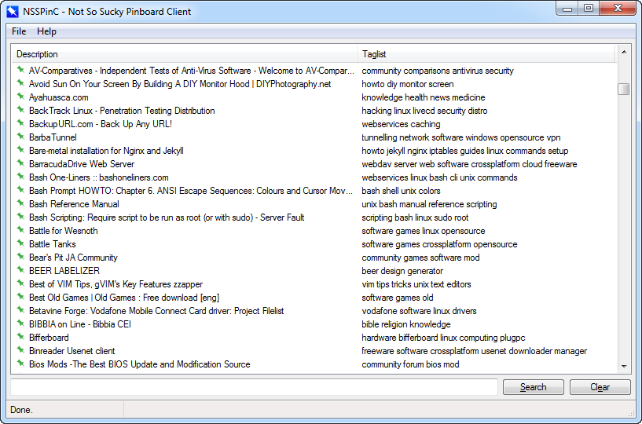
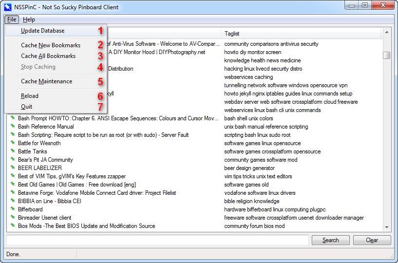
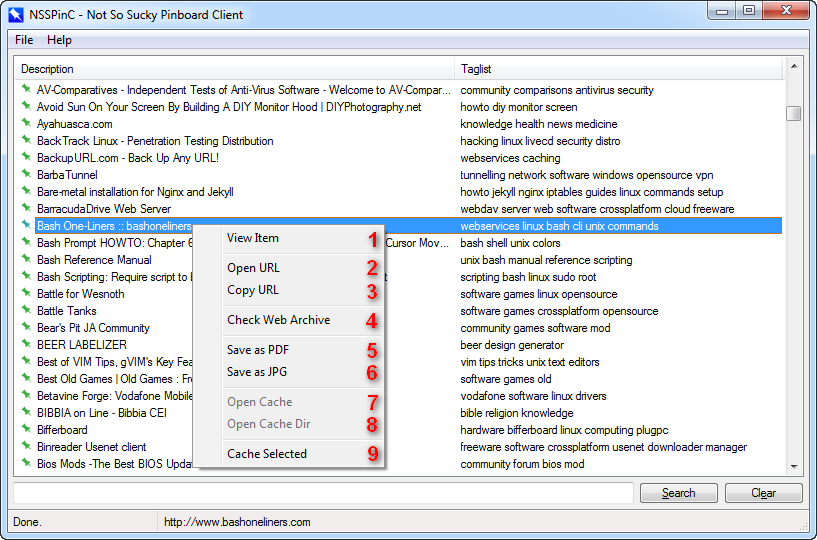

# NSSPinC

**PLEASE NOTE THAT THIS IS BETA SOFTWARE. I'M IN NO WAY RESPONSIBLE FOR ANY DATA LOSS.**

{: .imgcenter }

**NSSPinC**, acronym for *Not So Sucky Pinboard Client*, is a minimalistic [Pinboard](http://pinboard.in) client with caching support. It's written in [AutoHotkey](http://ahkscript.org) and offers very basic viewing and searching features and a full fledged caching system.

### Features

* Pinboard database synchronization.
* Regular expression based search.
* Caching system based on [Wget](https://www.gnu.org/software/wget/) and [Gzip](http://www.gzip.org/).
* Integration with the [wkhtmltopdf](http://wkhtmltopdf.org/) and [wkhtmltoimage](http://wkhtmltopdf.org/) utilities.
* [Internet Archive](http://archive.org/web/) bookmark search.
* Auto-update and cache on update.
* GUI position/size store and retrieval.
* Portable.

### How it works

*NSSPinC* works retrieving its database through the **Pinboard API** and filling the internal ListView with the database items. The items are then flattened and put in a string list that can be searched easily using regular expression. Each bookmark item in the ListView is preceded by a colored icon that denote the status of the bookmark:

* &nbsp; Public uncached bookmark.

* &nbsp; Private uncached bookmark.

* &nbsp; Public cached bookmark.

* &nbsp; Private cached bookmark.

The caching system works thanks to [Wget](https://www.gnu.org/software/wget/) and [Gzip](http://www.gzip.org/), downloading web components and eventually decompressing them if encoded with gzip or deflate. Other per-bookmark features are available through the context menu.

### Caching

The caching system allows to cache **uncached** bookmarks, **all** bookmarks or a **single** bookmark. A cache **maintenance** procedure can be started to delete the cached files for the bookmarks removed from the database.

Being based on *Wget* this feature is very flexible and allows a high degree of customization. The commandline used by *Wget* can be customized globally in the configuration file (setting the **CACHE_PARAM** option) or overridden directly in the confirmation window when caching a single bookmark. The default one is:

	--no-check-certificate --restrict-file-names=windows -e robots=off -U "Mozilla/5.0 (compatible; NSSPinC)" --wait=0.25 -N -E -H -k -nd -p

Please note that the following parameters cannot be used in a customized commandline:

* `-P` or `--directory-prefix`
* `-o` or `--output-file`

Please use respectively the **CACHE_DIR** option to change the cache directory prefix and the **ENABLE_DEBUG** option if you want a *Wget* log dump in the item cache directory.

### Remarks

The actual implementation of the Pinboard API is very basic. It strictly follows Pinboard guidelines regarding rate limits, but in a harsher way, doubling the waiting interval for any server error. It only implements the [posts/update](https://pinboard.in/api/#posts_update) and [posts/all](https://pinboard.in/api/#posts_all) API calls, so it basically check for an update and then retrieve the full database. Please refrain updating the database too frequently to avoid to pose a higher load on the server.

### Debug

*NSSPinC* has an integrated **debug** system that allows to log all the main operations, saving information and data in the **debug.txt** file in the program directory. If enabled it saves also a dump of the *Wget* log in each item cache directory.

Please note that the debug file may contain **sensible data**. If you detect a bug and want to signal it while keeping the sensible data hidden, please contact me.

### Setup and usage

1. Start *NSSPinC* so that it can generate the **NSSPinC.ini** configuration file in the program directory.

2. Visit the following page and copy the **API Token**: [https://pinboard.in/settings/password](https://pinboard.in/settings/password)

3. Paste the API Token in the **API_TOKEN** key of the configuration file, like the following:
        
		API_TOKEN=ahkuser:C31E4B15BFCADF4245E6

4. (*Optional*) Download the [wkhtmltox utilities](http://wkhtmltopdf.org/) and place the executables in the **Tools** folder.

5. Start *NSSPinC* and update the database clicking on the `File -> Update Database` menu item.

### Menu and features

The following screenshots show the window and context menu item.

{: .imgcenter }

Index  | Menu Item | Description
------ |---------- | -----------
1 | Update Database | Start database update procedure.
2 | Cache New Bookmarks | Start caching uncached bookmarks.
3 | Cache All Bookmarks | Start caching all bookmarks (overwrite already cached ones).
4 | Stop Caching | Stop caching, enabled only if caching.
5 | Cache Maintenance | Start cache maintenance (delete cache files for the bookmarks removed from the database).
6 | Reload | Reload the application.
7 | Quit | Exit from the application.

{: .imgcenter }

Index  | Menu Item | Description
------ |---------- | -----------
1 | View Item | Open a view bookmark item window showing all the details.
2 | Open URL | Open bookmark URL in the desired or default browser.
3 | Copy URL | Copy bookmark URL in the clipboard.
4 | Check Web Archive | Look for the bookmark URL in the Internet Archive.
5 | Save As PDF | Send bookmark URL to the wkhtmltopdf processor to create a PDF.
6 | Save As JPG | Send bookmark URL to the wkhtmltoimage processor to create a JPG.
7 | Open Cache | Open cache main html file for the selected bookmark in the desired or default browser.
8 | Open Cache Dir | Open the cache directory for the selected bookmark.
9 | Cache Selected | Start the caching procedure for the selected bookmark. It shows a confirmation window that allows the user to override *Wget* parameters.

### Configuration file

The configuration file options must be configured as per the following rules:

Setting  | Required | Default | Description
-------- |--------- | ------- | -----------
API_TOKEN | Yes | N/A | Pinboard API Token.
AUTOHDR | No | 0 | Adapt the headers of the ListView automatically.
BROWSER_CMDLINE | No | N/A | Command line string for the desired browser.
CACHE_DIR | No | .\Cache | Directory where the downloaded cache files will be placed.
CACHE_ENABLED | No | 1 | (0 or 1) If = 1, enable the caching subsystem. If = 0 disable it.
CACHE_EXE_DIR | No | .\Tools | Directory where the **Wget.exe** and **Gzip.exe** are placed.
CACHE_ON_UPDATE | No | 0 | (0 or 1) If = 1 Start caching automatically after a successful database update.
CACHE_PARAM | No | Check [CACHING](#caching) section* | Wget parameters used to download cache components.
COL1 | No | 300 | Description column width.
COL2 | No | 200 | Tags column width.
DEBUG_ENABLED | No | 0 | (0 or 1) If = 1 enable debugging on debug.txt. If = 0 disable it.
FULLSCREEN | No | 0 | Start the program maximized.
HEIGHT | No | 300 | Main window height.
HEIGHT_2 | No | 60 | Bookmark view window height.
POSX | No | Center | X position coordinate for the main window.
POSX_2 | No | Center | X position coordinate for the bookmark view window.
POSY | No | Center | Y position coordinate for the main window.
POSY_2 | No | Center | Y position coordinate for the bookmark view window.
SAVE_ON_CLOSE | No | 1 | (0 or 1) If = 1 autosave main window position and size.
SAVE_ON_CLOSE_2 | No | 1 | (0 or 1) If = 1 autosave bookmark view window position and size.
MIN_ON_CLOSE | No | 0 | (0 or 1) If = 1 minimize instead of closing when the window close button is pressed.
UPDATE_ON_START | No | 0 | (0 or 1) If = 1 update the database on program start.
WEB_ARCHIVE_PFX | No | http://web.archive.org/web/*/ | Prefix to search for the desired item on the Web Archive.
WIDTH | No | 520 | Main widow width.
WIDTH_2 | No | 300 | Bookmark view window width.
WKHTML_PATH | No | .\Tools | Directory where the wkhtmltox utilities are placrd.
WKHTML_IMG_PARAM | No | N/A | wkhtmltoimage parameters for saving bookmarks as jpg.
WKHTML_PDF_PARAM | No | --no-outline | wkhtmltopdf parameters for saving bookmarks as pdf.

Example:

	[SETTINGS]
	API_TOKEN=cyruz:D25A0A05BFCAAA4223E2
	SAVE_ON_CLOSE=1
	SAVE_ON_CLOSE_2=1
	MIN_ON_CLOSE=1
	AUTOHDR=0
	WIDTH=1263
	HEIGHT=662
	POSX=307
	POSY=159
	COL1=794
	COL2=327
	WIDTH_2=493
	HEIGHT_2=127
	POSX_2=544
	POSY_2=448
	DEBUG_ENABLED=1
	CACHE_DIR=D:\Cache

### License

[NSSPinC](https://github.com/cyruz-git/NSSPinC), [wkhtmltopdf](http://wkhtmltopdf.org/) and [wkhtmltoimage](http://wkhtmltopdf.org/) are released under the terms of the [GNU Lesser General Public License](http://www.gnu.org/licenses/). [Wget](https://www.gnu.org/software/wget/) and [Gzip](http://www.gzip.org/) are released under the term of the [GNU General Public License](http://www.gnu.org/licenses/). The icon used are part of [Visual Pharm's Windows 8 metro style set](http://icons8.com/download-huge-windows8-set/) and are licensed under the terms of the [Creative Commons Attribution-NoDerivs 3.0 Unported](https://creativecommons.org/licenses/by-nd/3.0/) license.

### Contact

For hints, bug reports or anything else, you can contact me at [focabresm@gmail.com](mailto:focabresm@gmail.com), open an issue on the dedicated [GitHub repo](https://github.com/cyruz-git/NSSPinC) or use the [AHKscript development thread](http://ahkscript.org/boards/viewtopic.php?f=6&t=1086).